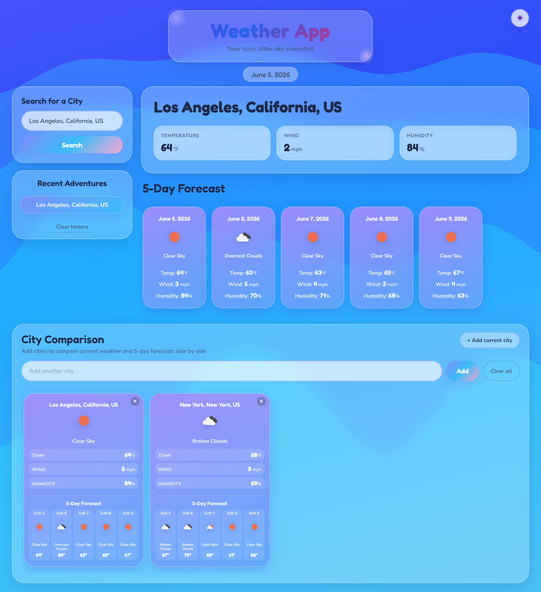

# Weather App

A dreamy, glass-style weather dashboard for searching cities, viewing a 5-day forecast, and comparing multiple locations side by side.



## Live demo

**https://tdglu.github.io/Weather-App/**

Every push to `main` deploys automatically with [GitHub Actions](.github/workflows/deploy.yml). If the site is not live yet, open **Settings → Pages** and set **Build and deployment** to **GitHub Actions**.

## Features

- **City search** — current temperature, wind, humidity, and conditions
- **5-day forecast** — daily icon, weather type (e.g. Clear Sky), temp, wind, and humidity
- **Search history** — recent cities saved in your browser (up to 6)
- **City comparison** — add many cities side by side with current weather and mini 5-day forecasts (up to 10)
- **Light / dark mode** — toggle in the top-right; preference is saved locally
- **Full location labels** — City, State, Country (e.g. Los Angeles, California, US)
- **Animated weather icons** — icons match the condition (sun, cloud, rain, etc.)

## Your data stays on your device

Search history, comparison cities, and theme preference are stored only in your browser (`localStorage`). That data is **never** committed to this Git repository. Weather details are fetched from the OpenWeather API when you search.

## Run locally

No build step required — static HTML, CSS, and JavaScript.

```bash
# From the project folder
python -m http.server 8765
```

Open **http://localhost:8765/** in your browser.

## Project structure

```
Weather-App/
├── index.html
├── assets/
│   ├── css/style.css
│   ├── js/script.js
│   ├── js/theme-init.js
│   └── imgs/
└── .github/workflows/deploy.yml
```

## Update the README screenshot

```bash
npm install playwright@1.49.1 --no-save
npx playwright install chromium
python -m http.server 8765
# In another terminal:
node scripts/capture-screenshot.mjs
```

Writes `assets/imgs/screenshot.png`.

## Tech

- HTML5, CSS3, JavaScript (no framework)
- [OpenWeatherMap API](https://openweathermap.org/api) for weather data
- GitHub Pages for hosting